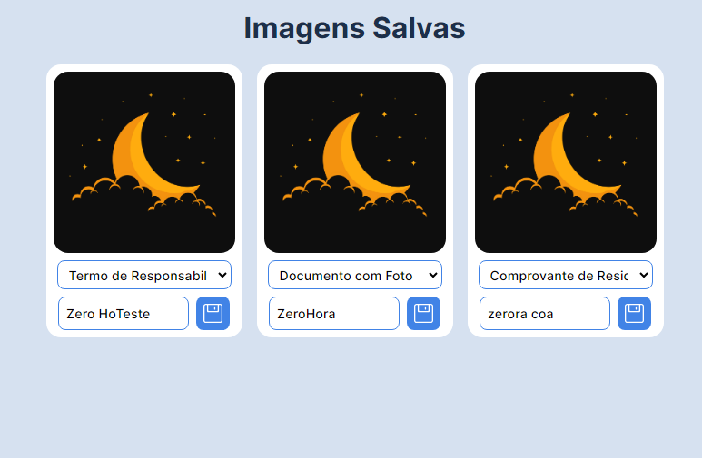

# organizador-pasta-compartilhada-impressora-scans
 Organiza Scans de pasta compartilhada de uma empresa ou residencia em rede local

 Eu queria resolver um problema no trabalho, onde precisamos escanear documentos, porem nem todos tem acesso direto a computadores e fazer isso pelo celular pode ser muito invasivo ja que é um objeto pessoal e nao deveria guardar os documentos necessarios, entao minha ideia foi criar uma pagina onde apos scanear um documento na impressora e salvar para uma pasta local que está no meu computador, outros poderiam ter acesso para organizar os scans e definir qual documento aquele arquivo se trata e quem é o dono dele.

## Aviso

Esse projeto não é newbie friendly, é necessário conhecimento basico em TI para conseguir utilizar o script ou configurar o ambiente.
Esse projeto está sendo compartilhado apenas para fins de estudo.

## Requisitos

- NodeJS
- Pasta Compartilhada configurada na Impressora

## Proposta

- Organizar arquivos de uma pasta compartilhada que contém scans de impressoras em rede local.
- Permite renomear os arquivos através de uma página web local.

## Como usar

- abra o Instalar.bat e aguarde a instalação das dependencias
- abra o Iniciar Servidor Local.bat

Mas tudo virá para a necessidade que eu precisava, então se você quiser usar, terá que fazer algumas modificações no código.

Deixei algumas coisas prontas, como um executal que inicia o servidor e logo da o endereço local para todos acessarem, mas estou supondo que quem queira usar isso tambem entende um pouco de programacao, do contrario, fazer modificacoes no codigo pode ser um pouco complicado, mas nao impossivel.

Partes do codigo foram comentadas para facilitar a compreensão.